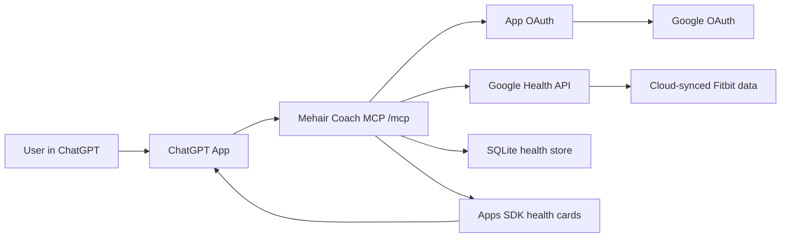

# Mehair Coach

Mehair Coach is a private-beta ChatGPT App for personal health and fitness coaching from Google Health / Fitbit data.

ChatGPT provides the conversation. This repo provides the Python MCP server that connects a user to Google Health, syncs their Fitbit-backed data, stores it securely, and exposes coaching tools plus inline health cards.

The app starts empty. It does not import demo data, seed personal exports, or pull anything until a user connects their own Google account.

## What the MCP Does

- Hosts a ChatGPT-compatible MCP endpoint at `/mcp`.
- Runs per-user Google OAuth for Google Health / Fitbit data.
- Encrypts Google tokens before storing them.
- Syncs read-only Google Health data into a local SQLite or hosted Turso/libSQL store.
- Starts a bounded bootstrap sync after Google OAuth so the first chat usually has fresh data ready.
- Lets ChatGPT inspect freshness before syncing again.
- Reports metric-level sync diagnostics instead of hiding Google/API timeouts behind generic connector errors.
- Exposes tools for readiness, sleep, HRV, resting heart rate, activity load, workouts, goals, check-ins, and live workout guidance.
- Returns clear setup and empty states when a user is not connected or has no synced data.
- Renders compact Apps SDK cards inside ChatGPT for health overviews, recovery comparisons, workout plans, and active-workout decisions.

## Product Design

The app is meant to feel like a personal health and fitness assistant, not a raw metrics dashboard.

The core UX is:

1. Ask a normal question in ChatGPT.
2. ChatGPT calls the MCP tools for the connected user.
3. The MCP returns structured health context and, when useful, a card.
4. ChatGPT explains the decision in plain language with the exact evidence it used.

Example questions:

```text
What should I focus on today based on my data?
Can I train hard today, or should I keep it controlled?
I only have 30 minutes after work. What is the best use of it?
How did sleep, HRV, and resting heart rate affect today's plan?
Why do I feel more tired than usual?
I want to lift tonight but my lower back is tight. What should I change?
I am halfway through intervals, HR 150, RPE 7, legs feel heavy, no pain. Keep going?
```

The assistant should combine wearable signals with user context. For example, it can use short sleep, low HRV, elevated resting heart rate, high zone minutes, soreness, goals, and planned workouts together instead of treating any single metric as the whole answer.

Metric labels stay visible, but the app explains them in normal language. For example, `HRV` is shown as a recovery stress signal, `RPE` as how hard the workout feels, `AZM` as Fitbit hard-work minutes, and `Resting HR` as heart stress at rest.

## Health Data Used

The first version is device-first and read-only. It focuses on data that Fitbit can sync through Google Health:

- Activity: steps, distance, active minutes, active zone minutes, calories, floors, sedentary periods.
- Heart: heart rate, resting heart rate, HRV, heart-rate zones.
- Sleep and recovery: sleep sessions, sleep stages, SpO2, respiratory rate, sleep temperature signals.
- Workouts: exercise sessions and recent training history.
- Capacity/profile: VO2 max and profile/settings data only where needed for the authorized connection.

Food and nutrition scopes are intentionally excluded.

## How It Works



Key pieces:

- `app/main.py` defines the MCP server, tool registration, OAuth routes, and widget resource.
- `app/health_store.py` syncs and summarizes Google Health data.
- `app/google_health.py` talks to Google Health APIs.
- `app/auth.py` handles app OAuth, Google OAuth, and token exchange.
- `app/widget.py` contains the inline ChatGPT card UI.
- `data/` holds local SQLite databases and is ignored by git. Hosted beta data can live in Turso/libSQL. Google tokens are encrypted before they are stored.

## MCP Tool Groups

Connection and sync:

- `connect_google_health_status`
- `sync_latest_fitbit_data`
- `sync_and_get_health_overview`
- `get_data_freshness`

Metric discovery and querying:

- `list_available_health_metrics`
- `query_health_metrics`
- `get_today_context`

Coaching and analysis:

- `get_health_overview`
- `get_recovery_readiness`
- `get_health_question_clues`
- `get_recovery_signal_comparison`
- `recommend_workout_today`
- `plan_workout_with_health_context`
- `guide_active_workout`

Specific summaries:

- `get_sleep_analysis`
- `get_activity_load`
- `get_heart_trends`
- `get_workout_history`

Local coaching memory:

- `set_goal`
- `log_checkin`

## Local Development

```bash
uv sync
uv run python -m app.crypto
cp .env.example .env
```

Fill in `.env`:

```bash
PUBLIC_BASE_URL=https://your-public-url.example
DATABASE_URL=sqlite:///./data/mehair-coach.sqlite3
LIBSQL_AUTH_TOKEN=
TOKEN_ENCRYPTION_KEY=...
GOOGLE_CLIENT_ID=...
GOOGLE_CLIENT_SECRET=...
GOOGLE_REDIRECT_URI=https://your-public-url.example/oauth/callback/google
SYNC_ON_CONNECT=true
SYNC_REQUEST_BUDGET_SECONDS=16
SYNC_METRIC_TIMEOUT_SECONDS=4
SYNC_METRIC_PAGE_LIMIT=4
SYNC_METRIC_CONCURRENCY=6
SYNC_METRIC_RECORD_LIMIT=600
```

Run the server:

```bash
uv run python -m app.main
```

Health check:

```bash
curl http://localhost:8787/health
```

ChatGPT connects to:

```text
https://your-public-url.example/mcp
```

For local ChatGPT testing, expose the server with an HTTPS tunnel and use that tunnel URL as `PUBLIC_BASE_URL`.

## Free Remote Hosting

GitHub hosts the public source repo, but GitHub Pages cannot run this MCP because it is a live Python server with OAuth callbacks.

The simplest free hosted setup is:

- GitHub for the repo.
- Render Free for the Python web service.
- Turso Free for the SQLite-compatible hosted database.

The repo includes `render.yaml` for the Render service:

- Python runtime pinned to 3.12.12.
- `uv sync --frozen --no-dev` build.
- `uv run --no-sync python -m app.main` start.
- `/health` health check.
- Free web instance with no persistent disk.
- Hosted persistence through `DATABASE_URL=libsql://...` and `LIBSQL_AUTH_TOKEN`.
- Secret env vars for `TOKEN_ENCRYPTION_KEY`, `GOOGLE_CLIENT_ID`, `GOOGLE_CLIENT_SECRET`, `DATABASE_URL`, and `LIBSQL_AUTH_TOKEN`.

After Render gives the service URL, add this redirect URI to the Google OAuth client:

```text
https://<service>.onrender.com/oauth/callback/google
```

Then create or refresh the ChatGPT developer-mode connector with:

```text
https://<service>.onrender.com/mcp
```

## Testing

Run the suite:

```bash
uv run pytest
```

Useful live checks:

```bash
curl http://localhost:8787/health
npx @modelcontextprotocol/inspector@latest --server-url http://localhost:8787/mcp --transport http
```

The tests cover OAuth metadata, encrypted token storage, empty states, synthetic health calculations, coaching evals, widget registration, tool schemas, deployment config, and local private-beta flows.

Live sync behavior is intentionally best-effort: the app pulls useful Fitbit metrics in parallel with per-metric timeouts, page caps, and an overall request budget. High-volume streams are written as daily summaries or aggregates during the chat request, so ChatGPT gets fresh usable context without waiting on thousands of remote database writes. Coverage diagnostics show which metrics were fresh, truncated, deferred, or errored.

## Safety Notes

- This is fitness coaching context, not medical diagnosis.
- Google Health scopes are read-only.
- Nutrition/food scopes are not requested.
- Tokens are encrypted at rest.
- `.env`, SQLite databases, local exports, caches, and virtualenvs are ignored by git.
- The public repo should never contain personal health exports, OAuth secrets, or production databases.
