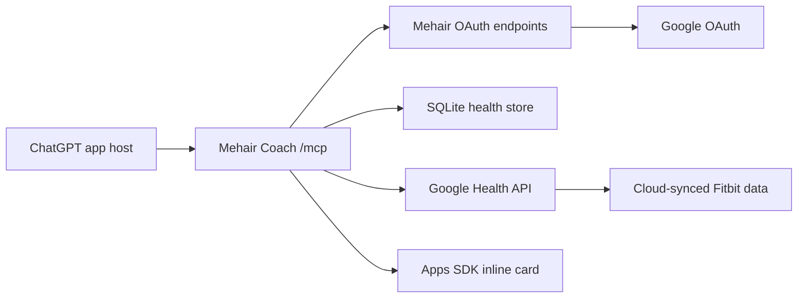

# Mehair Coach

Mehair Coach is a private-beta ChatGPT App that turns cloud-synced Fitbit data in Google Health into a personal fitness coaching context. ChatGPT provides the chat and model experience. This repo provides the Python MCP server, Google OAuth flow, encrypted token storage, SQLite health store, coaching tools, and optional inline health cards rendered inside ChatGPT.

The project starts empty. It does not import any existing Fitbit export and it does not pull data on startup. Each tester connects their own Google account through OAuth, then ChatGPT can call the tools for that user.

## What It Does

- Exposes a `/mcp` endpoint for ChatGPT developer-mode connectors.
- Authenticates each ChatGPT connector user with Google OAuth.
- Stores Google refresh/access tokens encrypted at rest.
- Syncs the latest Google Health data that came from Fitbit or other connected sources.
- Summarizes readiness, sleep, activity load, heart trends, and workout history.
- Stores local goals and subjective check-ins for better coaching prompts.
- Returns clear setup and empty-state responses when a user has not connected or synced yet.
- Shows an inline Apps SDK health card for readiness, sleep, activity, and evidence.

## What It Does Not Do

- It does not talk directly to the Fitbit device over Bluetooth.
- It does not use an OpenAI API key for chat. ChatGPT is the app host.
- It does not seed demo health data.
- It does not import `exports/fitbit-device-only-export.json`.
- It does not request nutrition/food scopes or pull food records.
- It is not medical advice or a medical device.

## Data Categories

The sync tool queries read-only Google Health data categories that are useful for Fitbit-based coaching:

- Activity: steps, active minutes, active zone minutes, activity level, distance, floors, active energy, total calories, sedentary periods.
- Heart: heart rate samples, resting heart rate, heart rate variability, time in heart-rate zone, calories in heart-rate zone.
- Sleep and recovery: sleep sessions, oxygen saturation, respiratory rate, respiratory-rate sleep summary, sleep temperature derivations.
- Fitness sessions: exercise/workout history and swim lengths.
- Capacity: daily VO2 max.
- Profile/settings: only where needed to support the user-authorized Google Health connection.

Food and nutrition are intentionally excluded because the first version is device-first coaching, and the user may not log food data.

## Architecture



## MCP Tools

- `connect_google_health_status` checks whether the current ChatGPT user is connected.
- `sync_latest_fitbit_data` pulls the latest available Google Health/Fitbit records.
- `get_data_freshness` reports last observed and last synced dates.
- `get_today_context` returns the latest daily activity, sleep, heart, readiness, and evidence.
- `get_recovery_readiness` returns the readiness score and evidence.
- `recommend_workout_today` recommends the day’s training intensity.
- `get_sleep_analysis` summarizes recent sleep.
- `get_activity_load` summarizes recent activity.
- `get_heart_trends` summarizes heart rate, resting heart rate, and HRV.
- `get_workout_history` lists recent exercise sessions.
- `set_goal` stores a local coaching goal.
- `log_checkin` stores subjective energy, soreness, stress, and notes.

## Local Setup

Install dependencies and generate a local encryption key:

```bash
cd coach
uv sync
uv run python -m app.crypto
cp .env.example .env
```

Fill in `.env`:

```bash
PUBLIC_BASE_URL=https://your-public-url.example
DATABASE_URL=sqlite:///./data/mehair-coach.sqlite3
TOKEN_ENCRYPTION_KEY=
GOOGLE_CLIENT_ID=
GOOGLE_CLIENT_SECRET=
GOOGLE_REDIRECT_URI=https://your-public-url.example/oauth/callback/google
```

Start the server:

```bash
uv run python -m app.main
```

The server listens on `http://localhost:8787` by default and exposes MCP at `/mcp`.

## Google OAuth Setup

1. Create or select a Google Cloud project.
2. Enable the Google Health API.
3. Create a Web OAuth client.
4. Add the redirect URI from `.env`, for example `https://abc123.ngrok.app/oauth/callback/google`.
5. Keep the OAuth app in Testing mode for private beta.
6. Add your email, and any friend tester emails, as Google OAuth test users.
7. Use read-only Google Health scopes only.

Official references:

- [Google Health setup](https://developers.google.com/health/setup)
- [Google Health scopes](https://developers.google.com/health/scopes)
- [Google Health data types](https://developers.google.com/health/data-types)

## ChatGPT Private Beta

ChatGPT needs an HTTPS URL for the MCP server. For local development:

```bash
ngrok http 8787
```

Then update `.env` with the ngrok origin:

```bash
PUBLIC_BASE_URL=https://abc123.ngrok.app
GOOGLE_REDIRECT_URI=https://abc123.ngrok.app/oauth/callback/google
```

Restart the server, then in ChatGPT:

1. Enable developer mode under Settings -> Apps & Connectors -> Advanced settings.
2. Create a connector.
3. Set the connector URL to `https://abc123.ngrok.app/mcp`.
4. Complete the Google OAuth flow when ChatGPT asks you to connect.
5. Ask prompts like:

```text
Sync latest Fitbit data.
How hard should I work out today?
Why?
Compare my sleep and heart rate.
```

For friend testing, give your friend the same public `/mcp` URL and add their email to the Google OAuth test users list. They create the connector in their own ChatGPT developer-mode settings and authorize their own Google account. Their data is stored under their own app user id.

Official Apps SDK references:

- [Apps SDK quickstart](https://developers.openai.com/apps-sdk/quickstart)
- [Connect from ChatGPT](https://developers.openai.com/apps-sdk/deploy/connect-chatgpt)
- [Apps SDK authentication](https://developers.openai.com/apps-sdk/build/auth)
- [Apps SDK testing](https://developers.openai.com/apps-sdk/deploy/testing)

## Testing

Run the local test suite:

```bash
uv run pytest
```

Run a quick health check:

```bash
curl http://localhost:8787/health
```

Use MCP Inspector:

```bash
npx @modelcontextprotocol/inspector@latest --server-url http://localhost:8787/mcp --transport http
```

The current automated tests cover OAuth metadata, encrypted token storage, setup/empty states, synthetic health calculations, MCP tool registration, widget registration, HTTP metadata routes, and a local private-beta E2E flow that simulates ChatGPT plus Google Health without creating live credentials.

## Security Notes

- `.env`, SQLite databases, ngrok config, virtualenvs, caches, and generated package metadata are ignored by git.
- Google tokens are encrypted with Fernet using `TOKEN_ENCRYPTION_KEY`.
- The Google Health integration requests read-only scopes.
- The public repository should never include personal exports, real tokens, Google client secrets, or production databases.
- Sync writes only to this app’s local SQLite store.

## Development Status

This is a private developer-mode beta. Public ChatGPT app submission, native iOS/Android packaging, direct device access, webhook live sync, and friend data validation are intentionally out of scope for the first release.
